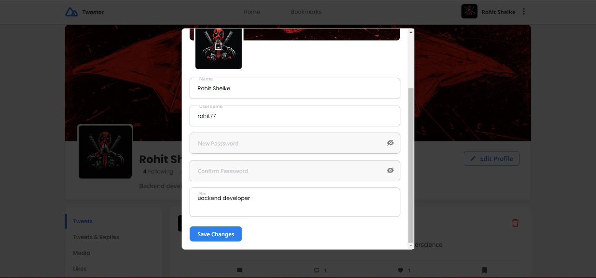

# Tweeter

Tweeter is a Twitter like social media app.  
Made with 💗 by **Rohit Shelke** and **Manthan Kuber**.  
App Url: https://tweeter-self.vercel.app/  
Backend Repo Url (for latest changes) : https://github.com/RohitShelkeBot/tweeter-backend  
(Due to certain constraints of hosting services we had to create a separate repo for our backend)  
Don't forget to ⭐ the repo 

## Contributions & Roles

#### Manthan Kuber [@Manthan-Kuber](https://www.github.com/RohitShelkeBot)
- Role: **FullStack**
- Client-Server architecture setup
- Worked on all of the FrontEnd
- Wrote Authentication Endpoints and Authentication Middleware
- Deciding features of the app and deciding how to build them
- Deployed the NextJs client app 

#### Rohit Shelke [@RohitShelkeBot](https://www.github.com/RohitShelkeBot)
- Role: **Backend**
- Created main APIs
- Deciding the type of database and managing it 
- Deployed the ExpressJs server app

## Tech Stack

- Built Entirely in **TypeScript**
- **NextJs** for client app and static site generator 
- **Redux Toolkit** for client side state management
- **Styled Components** for styling
- **RTK Query** for handlng server side state (API consumption and handling)
- **Node Js + Express Js** for server side app 
- **MongoDB** as no-sql database

## Features

- Infinite Scroll ♾️
- Instagram like Modals (Using shallow routing)
- Home Feed
- Lazy Loading Images
- Responsive Layout
- Signup / Login
- Post tweets with media, Delete tweets, Reply on tweets
- Change name, username, profile picture, cover picture and password
- View trending hashtags, popular users
- Follow / Unfollow users
- View user's profile(following, followers, tweets, likes, etc)
- Bookmark tweets
- Retweet tweets

## Screenshots

